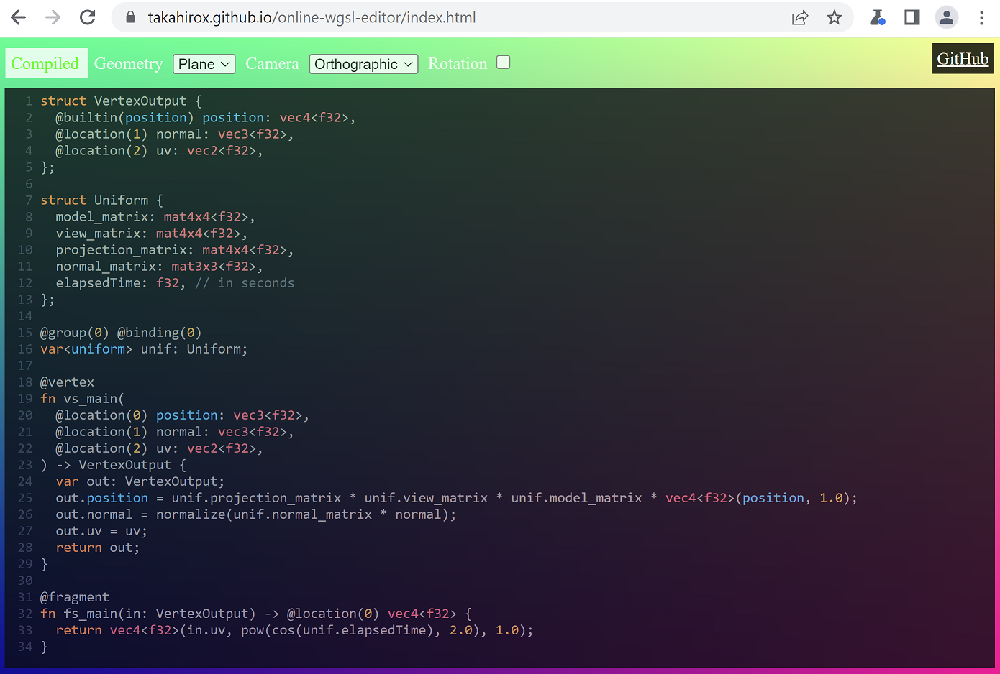

# online-wgsl-editor

`online-wgsl-editor` is a tiny online [WGSL (WebGPU Shading language)](https://www.w3.org/TR/WGSL/) editor.

You can test WGSL on your web browser. It is good especially for people who want to learn WGSL.

## Demo

[Online demo](https://takahirox.github.io/wgsl-sandbox/)

To try the demo, download [Google Chrome Canary](https://www.google.com/chrome/canary/) and enable `#enable-unsafe-webgpu` flag via `chrome://flags` because [WebGPU](https://www.w3.org/TR/webgpu) is still an experimental feature.

## Screenshots



## How to run locally

```sh
$ git clone https://github.com/takahirox/online-wgsl-editor.git
$ cd online-wgsl-editor
$ npm install
$ npm run start
# Access http://localhost:8080 on your web browser
```

## Thanks to

I referred to [Three.js](https://threejs.org/) and [glMatrix](https://glmatrix.net/) for WebGPU and Math.
